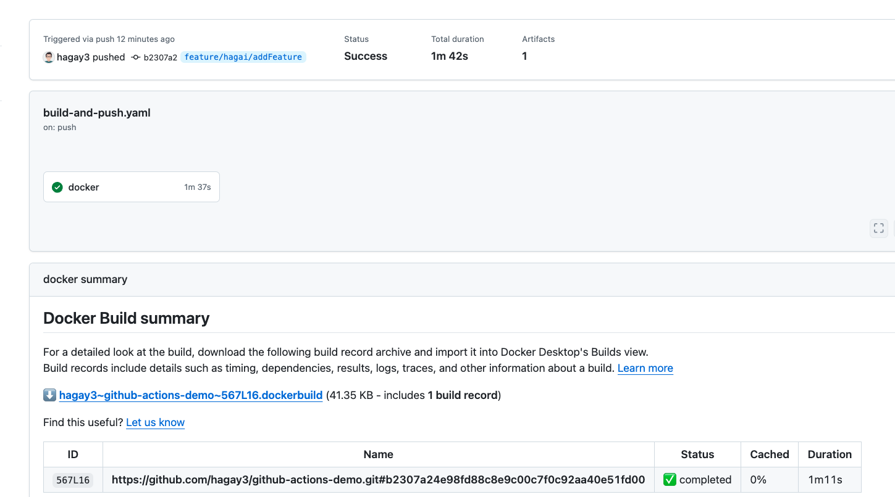
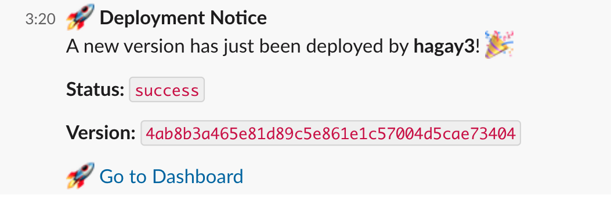

# 🚀 GitHub Actions CI/CD Demo

This repository demonstrates a **complete CI/CD pipeline** using **GitHub Actions** to build, push, and deploy Docker images, with **Slack notifications** integrated for deployment updates.

---

### 🧱 GitHub Actions – Build & Push


### 📣 Slack Deployment Notification

---

## 📸 Demo Overview

This project automates two major stages of deployment:

1. **Build & Push Workflow** – On every push, Docker builds the application image and pushes it to Docker Hub.
2. **Deploy Workflow** – Triggered manually via the GitHub UI (using `workflow_dispatch`) to deploy a specific image version to a remote server over SSH.


---

## ⚙️ Workflows Included

### ✅ Build & Push

Runs on every `git push`. This workflow:

- Logs into Docker Hub securely using GitHub secrets
- Builds the Docker image using Buildx
- Pushes the image with a SHA-based tag to your Docker Hub

```yaml
on: push
```

**Uses the following GitHub Actions:**

- [`docker/login-action`](https://github.com/docker/login-action)
- [`docker/setup-buildx-action`](https://github.com/docker/setup-buildx-action)
- [`docker/build-push-action`](https://github.com/docker/build-push-action)

---

### 🚀 Deploy

Manually triggered via GitHub UI with an input `version`. This workflow:

- SSHs into your production server using secrets
- Stops any running Docker containers
- Starts a new container with the specified image version
- Sends a Slack notification with deployment details

```yaml
on:
  workflow_dispatch:
    inputs:
      version:
        description: 'Version to deploy'
        required: true
```

**Uses the following GitHub Actions:**

- [`actions/checkout`](https://github.com/actions/checkout)
- [`slackapi/slack-github-action`](https://github.com/slackapi/slack-github-action)


---

## 🔐 Secrets Used

| Secret Name            | Description                                  |
|------------------------|----------------------------------------------|
| `DOCKERHUB_USERNAME`   | Docker Hub username                          |
| `DOCKERHUB_TOKEN`      | Docker Hub access token/password             |
| `SERVER_USER`          | SSH username for the remote server           |
| `SSH_PRIVATE_KEY`      | Private key used to SSH into the server      |
| `SLACK_WEBHOOK_URL`    | Incoming Slack webhook for notifications     |


## 📚 References & Sources

- Docker GitHub Actions:
    - [docker/login-action](https://github.com/docker/login-action)
    - [docker/setup-buildx-action](https://github.com/docker/setup-buildx-action)
    - [docker/build-push-action](https://github.com/docker/build-push-action)

- Slack GitHub Actions Integration:
    - [slackapi/slack-github-action](https://github.com/slackapi/slack-github-action)

- SSH Deployment Strategy:
    - Manual SSH via GitHub Actions to remote server (custom script)

---

## 🌐 Demo App

Once deployed, you can view the dashboard at:  
👉 [http://production-github-actions-demo.hagaiacademy.com:3000/volt-react-dashboard#/dashboard/overview](http://production-github-actions-demo.hagaiacademy.com:3000/volt-react-dashboard#/dashboard/overview)

---


## 🏁 Final Notes

This project is a lightweight and powerful example of real-world CI/CD using GitHub Actions, Docker, SSH deployment, and Slack Notifications 🚀
